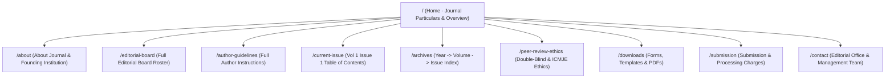

# System Architecture & Technical Specifications

## Framework & Tooling
- **Framework**: Next.js 14+ (App Router)
- **Language**: TypeScript
- **Styling**: Tailwind CSS with custom editorial design tokens
- **Output Mode**: Static Site Export (`output: 'export'`)
- **Fonts**: `@fontsource` / Google Fonts (Cormorant Garamond, Source Serif 4, Inter)

---

## Sitemap & Route Hierarchy



---

## Design System Tokens

```css
:root {
  --color-primary: #5B1E1E;   /* Maroon accent */
  --color-secondary: #E8D5B5; /* Cream cards/dividers */
  --color-accent: #B8860B;    /* Gold badges/tags */
  --color-bg: #FDFBF8;        /* Off-white background */
  --font-masthead: 'Cormorant Garamond', serif;
  --font-headline: 'Source Serif 4', serif;
  --font-body: 'Inter', sans-serif;
}
```

---

## Data Schema for Issues (`content/issues/*.json`)

```json
{
  "year": 2026,
  "volume": 1,
  "issue": 1,
  "month": "January-June",
  "fullIssuePdf": "/articles/2026-v1-i1/full-issue.pdf",
  "articles": [
    {
      "id": "article-01",
      "type": "Original Article",
      "title": "Full Unabbreviated Title",
      "authors": ["Author One", "Author Two"],
      "pages": "1-8",
      "pdfUrl": "/articles/2026-v1-i1/article-01.pdf",
      "abstract": "Summary abstract text..."
    }
  ]
}
```
